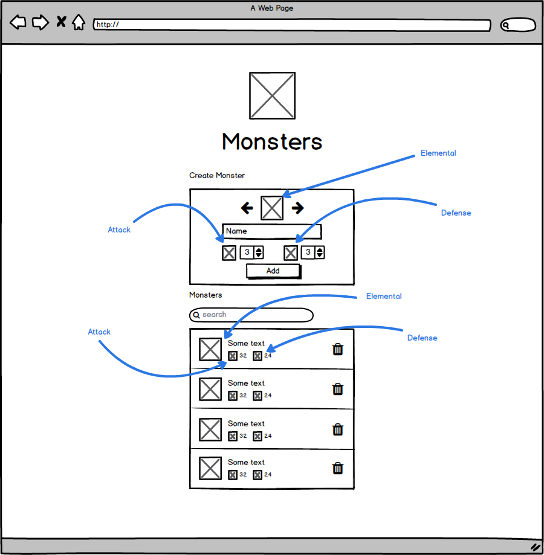

# Monsters
> Frontend gyakorló projekt

Hozzátartozó magyarázó videó elérhető a YouTube-on: https://youtu.be/Ms6VEA5bTQQ

## Követelmények
- Újabb szörnyek felvétele
- Felvett szörnyek listázása
- Felvett szörnyek törlése egyesével
- Listán való keresés szörny neve alapján

## Szörny adatai
- Négy elem egyike: Tűz, Föld, Levegő, Víz (sztring/szám/enum)
- Név (sztring)
- Támadási érték (szám)
- Védekezési érték (szám)

## Felület követelmények
A következőket kell látnunk a felületen:
- projekt logója (`logo.svg`)
- projekt címe (Monsters)
- egy űrlapot ahol fel tudunk venni újabb szörnyeket
  - itt a szörny elemét egy jobbra-balra léptetővel (`icons/arrow-left.svg`, `icons/arrow-right.svg`) kell tudnunk kiválasztani. A léptetők között látszódjon a jelenlegi elem ikonja (`icons/air.svg`, `icons/water.svg`, `icons/earth.svg`, `icons/fire.svg`)
  - egy szöveges mező ahol megadhatjuk a szörny nevét
  - egy szám mező ahol megadhatjuk a szörny támadási értékét, mellette a támadási ikon (`icons/attack.svg`)
  - egy szám mező ahol megadhatjuk a szörny védekezési értékét, mellette a védekezi ikont (`icons/defense.svg`)
  - egy gomb, amivel hozzáadjuk a szörnyet, a gomb megnyomásával megjelenik a szörny és az űrlap visszaáll üres állapotba
- egy listát ahol látjuk az összes szörnyet
- egy keresőt ahol a fentebb említett listán szűrhetünk név alapján
- a listán belül látnunk kell
  - a szörny elemjének az ikonját (`icons/air.svg`, `icons/water.svg`, `icons/earth.svg`, `icons/fire.svg`)
  - a szörny nevét
  - a szörny támadási értékét és annak ikonját (`icons/attack.svg`)
  - a szörny védekezési értékét és annak ikonját (`icons/defense.svg`)
  - egy törlés ikont (`icons/trash-can.svg`)

## Felület drótváz

## Megoldások
> Megcsináltad már ezt a feladatot és szeretnéd kitenni ide? Nyiss egy issue-t!
Még sajnos egy sincs. 

Az ikonokat [Game-icons.net](https://game-icons.net/)-nek köszönhetjük!
